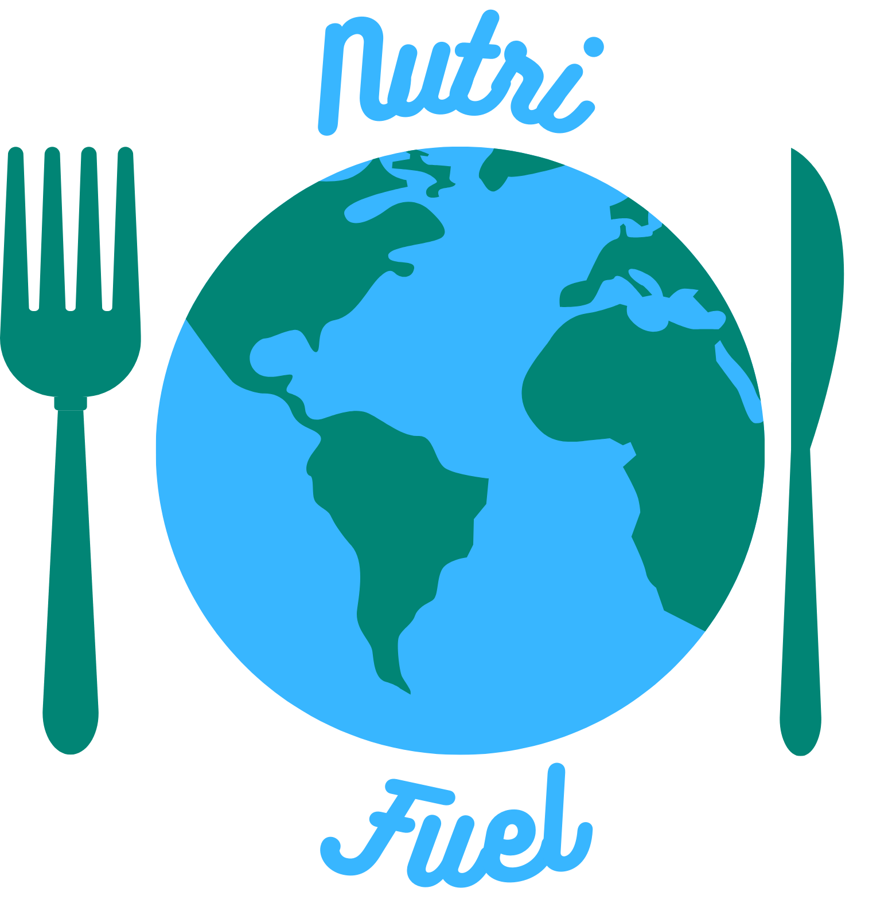

<div align="center">
  
  
  # NutriFuel
  
  **Your AI-Powered Nutrition Companion for Global Travel**
  
  [](https://nextjs.org/)
  [](https://reactjs.org/)
  [](https://www.typescriptlang.org/)
  [](https://tailwindcss.com/)
  [](LICENSE)
  
</div>

---

## 🌍 About NutriFuel

NutriFuel is an intelligent nutrition tracking application designed specifically for travelers. Whether you're exploring Tokyo's ramen shops, sampling tapas in Barcelona, or enjoying street food in Bangkok, NutriFuel helps you maintain your health goals while experiencing authentic local cuisine.

**The Challenge**: Traveling often means sacrificing your nutrition goals or missing out on local culinary experiences. Traditional nutrition apps don't understand local cuisines or account for timezone changes.

**Our Solution**: NutriFuel combines AI-powered meal analysis with cultural food knowledge across 28 countries and 9 languages. Get personalized meal plans that embrace local dishes while keeping you on track with your health goals.

### ✨ Key Features

- **🎯 Smart Onboarding**: Personalized nutrition goals based on your profile, dietary restrictions, and preferences
- **🌐 Multi-Language Support**: Full support for 9 languages with localized date/time formats
- **🍽️ Local Cuisine Discovery**: AI-powered recommendations for local dishes across 28 countries
- **📊 Real-Time Nutrition Tracking**: Monitor calories, macros, and water intake with visual progress rings
- **✈️ Trip Planning**: Plan meals ahead with timezone-aware nutrition adjustments and local nutritionist insights
- **📸 Meal Analysis**: Snap photos of your meals for instant AI-powered nutrition breakdown
- **🥗 Menu Scanner**: Analyze restaurant menus to find suitable options with allergen warnings
- **🔄 Nutrium Integration**: Connect with Nutrium for professional nutrition plan synchronization
- **💧 Hydration Tracking**: Stay hydrated with smart water intake tracking and reminders
- **🌙 Dark Mode**: Beautiful light and dark themes with seamless switching
- **🔒 Privacy-First**: All data stored locally on your device - no cloud accounts required

---

## 🚀 Getting Started

### Prerequisites

- **Node.js**: 18.0 or higher ([Download](https://nodejs.org/))
- **pnpm**: 8.0 or higher (recommended) - Install with `npm install -g pnpm`
  - Alternatively: npm or yarn
- **OpenAI API Key**: Get yours at [platform.openai.com](https://platform.openai.com/api-keys)
  - Can be configured later during app setup

### Installation

1. **Clone the repository**
   ```bash
   git clone https://github.com/Diogo-Rodriigues/Lifehackers-BugsByte-Hackathon-26.git
   cd NutriFuel
   ```

2. **Install dependencies**
   ```bash
   pnpm install
   ```

3. **(Optional) Set up environment variables**
   
   Create a `.env.local` file in the root directory to set a default API key:
   ```env
   NEXT_PUBLIC_DEFAULT_API_KEY=your_openai_api_key_here
   ```
   
   *Note: You can also configure your API key later during the app's onboarding process.*

4. **Run the development server**
   ```bash
   pnpm dev
   ```

5. **Open your browser**
   
   Navigate to [http://localhost:3000](http://localhost:3000)

---

## 📁 Project Structure

```
nutrifuel/
├── app/                       # Next.js app directory
│   ├── api/                   # API routes
│   │   ├── adapt-plan/        # Meal plan adaptation
│   │   ├── analyze-meal/      # Meal photo analysis
│   │   ├── analyze-menu/      # Menu scanning
│   │   ├── dishes/            # Local cuisine discovery
│   │   ├── dynamic-targets/   # Nutrition goal calculations
│   │   ├── meal-plan/         # Trip meal planning
│   │   ├── nutrition-goals/   # Goal estimation
│   │   └── nutrium/           # Nutrium integration
│   ├── globals.css            # Global styles
│   ├── layout.tsx             # Root layout
│   └── page.tsx               # Main application page
├── components/                # React components
│   ├── ui/                    # shadcn/ui components
│   ├── bottom-nav.tsx         # Navigation bar
│   ├── dashboard.tsx          # Main dashboard
│   ├── meal-analysis.tsx      # Meal analyzer
│   ├── meal-logger.tsx        # Manual meal entry
│   ├── onboarding.tsx         # User onboarding flow
│   ├── settings-page.tsx      # Settings & profile
│   ├── splash-screen.tsx      # App splash screen
│   ├── trip-planning.tsx      # Trip planning interface
│   ├── trip-review.tsx        # Trip review screen
│   └── welcome-screen.tsx     # Welcome screen
├── lib/                       # Utility functions
│   ├── api.ts                 # API client
│   ├── constants.ts           # App constants
│   ├── language.ts            # i18n support
│   ├── meal-culture.ts        # Cultural meal data
│   ├── store.ts               # Local storage management
│   ├── types.ts               # TypeScript types
│   └── utils.ts               # Helper functions
├── public/                    # Static assets
│   ├── favicon_io/            # Favicons
│   ├── nutritionists/         # Nutritionist avatars
│   ├── logo.png               # App logo
│   └── nutrium-logo.png       # Nutrium logo
├── hooks/                     # Custom React hooks
└── docs/                      # Documentation
```

---

## 🛠️ Technology Stack

### Frontend
- **Next.js 16.1.6**: React framework with App Router
- **React 19.2.3**: UI library
- **TypeScript 5.7.3**: Type safety
- **Tailwind CSS 3.4.17**: Utility-first styling
- **shadcn/ui**: High-quality UI components
- **Radix UI**: Accessible component primitives
- **Lucide React**: Beautiful icons

### State Management
- **Local Storage**: Client-side data persistence
- **React Hooks**: Component state management

### AI & APIs
- **OpenAI GPT-4**: Meal analysis, menu scanning, and recommendations
- **Nutrium API**: Professional nutrition plan integration

### Utilities
- **date-fns**: Date manipulation
- **react-day-picker**: Calendar component
- **recharts**: Data visualization
- **sonner**: Toast notifications
- **next-themes**: Theme management

---

## 🎨 Features in Detail

### 1. Onboarding Flow
- **Language Selection**: Choose from 9 supported languages
- **Personal Profile**: Age, sex, height, weight, and fitness goals
- **Allergies & Dietary Preferences**: Comprehensive allergen tracking with AI safety guardrails
- **Nutrition Method**: Choose between AI estimation or Nutrium sync
- **Trip Details**: Destination, dates, times with localized date/time pickers and timezone awareness
- **Cuisine Discovery**: Browse and select local dishes you want to try
- **Meal Plan Generation**: AI creates a personalized itinerary for your trip
- **Nutritionist Review**: Optional local nutritionist verification

### 2. Trip Planning
- **Local Cuisine Discovery**: AI-curated local dishes filtered by your dietary needs
- **Meal Plan Generation**: Personalized itinerary for your entire trip
- **Nutritionist Review**: Professional tips from local nutrition experts
- **Caffeine Management**: Jet lag mitigation recommendations

### 3. Dashboard
- **Daily Overview**: Calories, macros, water intake at a glance
- **Interactive Charts**: Visual progress tracking
- **Meal Log**: Complete history of logged meals
- **Quick Actions**: Fast access to meal logging and analysis

### 4. Meal Analysis
- **Photo Analysis**: Take a picture, get instant nutrition breakdown
- **Menu Scanning**: Scan restaurant menus for suitable options
- **Manual Entry**: Traditional food diary with autocomplete

### 5. Multi-Language Support

**9 Languages Fully Supported:**
- 🇬🇧 English (EN)
- 🇵🇹 Portuguese - Portugal (PT-PT)
- 🇧🇷 Portuguese - Brazil (PT-BR)
- 🇪🇸 Spanish (ES)
- 🇫🇷 French (FR)
- 🇩🇪 German (DE)
- 🇮🇹 Italian (IT)
- 🇨🇳 Chinese (ZH)
- 🇯🇵 Japanese (JA)

**Localized Features:**
- Translated UI and messaging
- Language-specific date formats (MM/DD/YYYY, DD/MM/YYYY, YYYY/MM/DD, etc.)
- Localized time pickers with appropriate AM/PM indicators
- Cultural meal naming and descriptions
- Proper abbreviations and punctuation per language

---

## 🌐 Supported Destinations

NutriFuel currently supports nutrition guidance for **28 countries**:

🇵🇹 Portugal | 🇯🇵 Japan | 🇹🇭 Thailand | 🇲🇽 Mexico | 🇮🇹 Italy | 🇮🇳 India | 🇫🇷 France | 🇲🇦 Morocco | 🇵🇪 Peru | 🇰🇷 South Korea | 🇪🇸 Spain | 🇹🇷 Turkey | 🇻🇳 Vietnam | 🇬🇷 Greece | 🇧🇷 Brazil | 🇨🇴 Colombia | 🇩🇪 Germany | 🇨🇳 China | 🇺🇸 United States | 🇦🇪 UAE | 🇮🇩 Indonesia | 🇦🇷 Argentina | 🇪🇬 Egypt | 🇦🇺 Australia | 🇳🇱 Netherlands | 🇨🇦 Canada | 🇱🇺 Luxembourg | 🇨🇭 Switzerland

Each destination includes:
- Local nutritionist profiles
- Cultural meal recommendations
- Timezone-aware adjustments
- Popular local dishes

---

## 🔐 Environment Variables

The app requires an OpenAI API key for AI-powered features. You can either:

1. **Configure during onboarding** (recommended): Enter your API key in the app's onboarding flow
2. **Set a default key**: Create a `.env.local` file with:

| Variable | Description | Required |
|----------|-------------|----------|
| `NEXT_PUBLIC_DEFAULT_API_KEY` | Default OpenAI API key for AI features | Optional* |

*The app will prompt for an API key during first use if not set.

---

## 🧪 Development

### Available Scripts

```bash
# Start development server with Turbopack
pnpm dev

# Build for production
pnpm build

# Start production server
pnpm start

# Run linter
pnpm lint
```

### Code Quality

This project follows best practices:
- **TypeScript**: Strict type checking for reliability
- **ESLint**: Code linting with Next.js configuration
- **Modular Architecture**: Clean component separation
- **Accessibility**: WCAG 2.1 Level AA compliance
- **Responsive Design**: Mobile-first approach

---

## 🗺️ Roadmap

### Phase 1 - Core Features ✅
- [x] Multi-language support (9 languages)
- [x] 28 destination countries
- [x] AI meal analysis and planning
- [x] Localized date/time formats
- [x] Local nutritionist profiles
- [x] Privacy-first local storage

### Phase 2 - Enhancements
- [ ] Implement cloud sync with optional user accounts
- [ ] Add social features (share meals, trips)
- [ ] Integrate with fitness trackers (Apple Health, Google Fit)
- [ ] Add recipe suggestions based on local ingredients
- [ ] Expand to 50+ destination countries
- [ ] Add more language support (Arabic, Hindi, Korean)

### Phase 3 - Platform Expansion
- [ ] Mobile app (React Native)
- [ ] Progressive Web App (PWA) with offline mode
- [ ] Browser extension for quick menu scanning
- [ ] Export nutrition reports (PDF, CSV)
- [ ] Integration with travel apps

---

## 📄 License

This project is licensed under the MIT License - see the [LICENSE](LICENSE) file for details.

---

## 🙏 Acknowledgments

- **shadcn/ui** for the beautiful component library
- **Nutrium** for nutrition plan integration
- **OpenAI** for GPT-4 API
- **Unsplash** for destination images
- **Lifehackers Team** for development

---

## 📞 Support & Contributing

### Get Help
- 📧 Contact the LifeHackers team
- 🐛 Report issues on GitHub
- 💡 Request features via GitHub Issues

### Contributing
We welcome contributions! See [CONTRIBUTING.md](docs/CONTRIBUTING.md) for guidelines.

### Documentation
- [API Documentation](docs/API.md)
- [Component Guide](docs/COMPONENTS.md)
- [Deployment Guide](docs/DEPLOYMENT.md)

---

## 🏆 Built For

This project was created for the **BugsByte 2026 Hackathon** by the **LifeHackers** team.

---

<div align="center">
  <p>Made with ❤️ for travelers who care about their health</p>
  <p>© 2026 LifeHackers Team. All rights reserved.</p>
</div>
